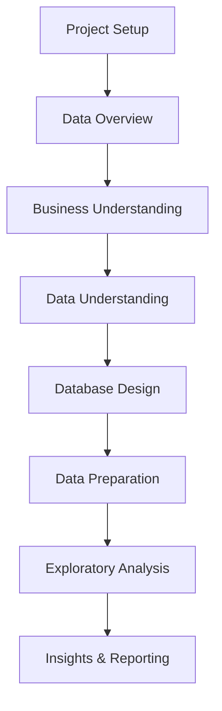

# 📊 Data Analysis
Metodologias práticas, templates e guias para projetos completos de análise de dados e modelação.

## 🎯 **Guias Práticos**

### [📋 Analysis Methodology](analysis_methodology.md)
**Workflow completo CRISP-DM adaptado para Data Analytics**
- ✅ 7 fases estruturadas: Setup → Overview → Business → Data → Design → Preparation → EDA → Reporting
- ✅ Checklists práticos para cada fase
- ✅ Templates Python/SQL prontos a usar
- ✅ Toolkit avançado com 50+ funções úteis

### [✅ Project Checklist](project_checklist.md)  
**Checklist sequencial rápido para projetos de analytics**
- ✅ Passos essenciais por fase
- ✅ Comandos Python/SQL fundamentais
- ✅ Definition of Done para cada etapa

### [🏗️ Data Modeling Guide](data_modeling_guide.md)
**Conceitos fundamentais e práticas de modelação**
- ✅ Entidades, Relacionamentos, Fact & Dimension Tables
- ✅ Star Schema design patterns
- ✅ Slowly Changing Dimensions (SCD)
- ✅ Validation & Testing strategies

### [💾 SQL Templates](#sql-reference-templates)
**Biblioteca de queries SQL para análise**
- ✅ Data profiling e quality assessment
- ✅ Join validation e relationship analysis  
- ✅ Time series e cohort analysis
- ✅ Window functions e performance optimization

## 🛠️ **Toolkit Recomendado**

### Python Stack
```bash
# Core analysis
uv add pandas numpy matplotlib seaborn plotly
uv add jupyter sqlalchemy psycopg2-binary

# Advanced analytics  
uv add scikit-learn scipy statsmodels
uv add pandas-profiling great-expectations
```

### SQL Databases
- **PostgreSQL** - Analysis avançada com window functions
- **DuckDB** - Analytics em ficheiros (Parquet, CSV)
- **SQLite** - Prototyping e datasets pequenos
- **BigQuery/Snowflake** - Cloud data warehousing

### Visualization Tools
- **Plotly/Dash** - Interactive dashboards
- **Tableau** - Business intelligence
- **Jupyter Notebooks** - Exploratory analysis
- **Apache Superset** - Open source BI

## 🔄 **Workflow Recomendado**



### Quick Start
1. **Setup**: `uv init` + estrutura de pastas + `.env`
2. **Overview**: Inventário rápido com `df.info()`, `df.describe()`
3. **Business**: Definir KPIs e critérios de sucesso
4. **Understanding**: Data profiling completo + quality assessment
5. **Design**: ER diagram + estratégia de joins
6. **Preparation**: ETL + feature engineering + validation
7. **EDA**: Correlações, segmentações, insights quantificados
8. **Reporting**: 1-pager + reprodutível package

## 📈 **Casos de Uso Típicos**

### Customer Analytics
- **Segmentação** por comportamento e valor
- **Cohort analysis** para retenção
- **Lifetime value** prediction
- **Churn analysis** e early warning

### Sales Analytics  
- **Performance dashboards** por região/produto
- **Seasonal patterns** e forecasting
- **Conversion funnel** analysis
- **Price optimization** studies

### Operational Analytics
- **Process optimization** com time series
- **Resource allocation** optimization  
- **Quality metrics** monitoring
- **Capacity planning** analysis

## 🎯 **Best Practices**

### ✅ **Do's**
- Começar com business understanding claro
- Validar qualidade dos dados antes da análise
- Documentar assumptions e limitações
- Criar scripts reproduzíveis
- Testar conclusions com different time periods

### ❌ **Don'ts**  
- Assumir que correlação = causação
- Ignorar missing data patterns
- Sobre-complicar o modelo inicial
- Esquecer de validar joins antes de usar
- Deixar análises sem actionable insights

---

## 💾 **SQL Reference & Templates**

<details>
<summary><strong>🔧 Quick SQL Setup & Connection</strong></summary>

### Database Management Essentials
```sql
-- Criar uma BD
CREATE DATABASE IF NOT EXISTS tests_db;
USE tests_db;

-- Listar bases e tabelas
SHOW DATABASES;
USE films;
SHOW TABLES;

-- Ver schema
DESCRIBE movie_ratings;
SHOW CREATE TABLE movie_ratings;
```

### Basic CRUD Operations
```sql
-- Inserir / atualizar / apagar
INSERT INTO movie_ratings(user_name,movie_id,rating) VALUES ('Diogo', 999, 8.7);
UPDATE movie_ratings SET rating=9.2 WHERE id=1;
DELETE FROM movie_ratings WHERE id=1;

-- Transações
START TRANSACTION;
-- ...queries...
COMMIT;  -- ou ROLLBACK;

-- Diagnóstico de permissões
SHOW GRANTS FOR CURRENT_USER();
SELECT CURRENT_USER(), USER();
```

</details>

<details>
<summary><strong>🔍 Data Exploration Templates</strong></summary>

### General Database Exploration
```sql
-- listar bases e privilégios
SHOW DATABASES;
SELECT CURRENT_USER() AS current_user;
SHOW GRANTS FOR CURRENT_USER();

-- dentro de uma BD:
USE <db>;
SHOW TABLES;

-- tamanho aproximado das tabelas (InnoDB)
SELECT
  table_name,
  ROUND((data_length+index_length)/1024/1024, 2) AS size_mb
FROM information_schema.tables
WHERE table_schema = DATABASE()
ORDER BY size_mb DESC;

-- colunas e tipos
SELECT column_name, data_type, is_nullable, column_key, column_default
FROM information_schema.columns
WHERE table_schema = DATABASE() AND table_name = '<tabela>'
ORDER BY ordinal_position;

-- DDL
SHOW CREATE TABLE <tabela>\G
```

### Schema Analysis for Specific Databases
```sql
-- motogp_db (projeto exemplo)
USE motogp_db;
SHOW TABLES;

-- lista colunas de todas as tabelas (resumo)
SELECT t.table_name, c.column_name, c.data_type
FROM information_schema.tables t
JOIN information_schema.columns c
  ON c.table_schema=t.table_schema AND c.table_name=t.table_name
WHERE t.table_schema = 'motogp_db'
ORDER BY t.table_name, c.ordinal_position;
```

</details>

<details>
<summary><strong>📊 Advanced Analytics Queries</strong></summary>

### Aggregations & Rankings
```sql
-- Top 10 filmes por rating médio (films)
USE films;
SELECT movie_id, AVG(rating) AS avg_rating, COUNT(*) AS n_ratings
FROM movie_ratings
GROUP BY movie_id
HAVING COUNT(*) >= 5
ORDER BY avg_rating DESC, n_ratings DESC
LIMIT 10;
```

### CTEs + Window Functions
```sql
-- Ranking com CTE
WITH movie_stats AS (
  SELECT
    movie_id,
    AVG(rating) AS avg_rating,
    COUNT(*)    AS n_ratings
  FROM movie_ratings
  GROUP BY movie_id
)
SELECT
  movie_id, avg_rating, n_ratings,
  RANK() OVER (ORDER BY avg_rating DESC) AS rank_by_avg
FROM movie_stats
WHERE n_ratings >= 5
ORDER BY rank_by_avg;

-- Percentis com NTILE
WITH r AS (
  SELECT movie_id, rating
  FROM movie_ratings
)
SELECT
  movie_id,
  AVG(rating) AS avg_rating,
  NTILE(4) OVER (ORDER BY AVG(rating)) AS quartil  -- 1..4
FROM r
GROUP BY movie_id
ORDER BY quartil, avg_rating;
```

### Rolling Averages & Time Series
```sql
-- Rolling average (médias móveis) por utilizador
SELECT
  user_name,
  rating_date,
  rating,
  AVG(rating) OVER (
    PARTITION BY user_name
    ORDER BY rating_date
    ROWS BETWEEN 4 PRECEDING AND CURRENT ROW
  ) AS avg_last_5
FROM movie_ratings
ORDER BY user_name, rating_date;
```

### Data Deduplication
```sql
-- Deduplicação com Window
WITH ranked AS (
  SELECT
    *,
    ROW_NUMBER() OVER (PARTITION BY user_name, movie_id ORDER BY rating_date DESC) AS rn
  FROM movie_ratings
)
SELECT *
FROM ranked
WHERE rn = 1;
```

### Complex Analytics Examples
```sql
-- motogp_db – podium rate por piloto
USE motogp_db;
WITH results AS (
  SELECT rider_id, position
  FROM race_results
  WHERE class = 'MotoGP'
),
agg AS (
  SELECT
    rider_id,
    COUNT(*) AS races,
    SUM(CASE WHEN position <= 3 THEN 1 ELSE 0 END) AS podiums
  FROM results
  GROUP BY rider_id
)
SELECT
  r.rider_id,
  a.rider_name,
  races, podiums,
  ROUND(podiums*100.0/races, 2) AS podium_rate_pct
FROM agg
JOIN riders a ON a.id = r.rider_id
ORDER BY podium_rate_pct DESC
LIMIT 20;
```

</details>

<details>
<summary><strong>⚡ Performance & Security</strong></summary>

### Index Management
```sql
-- procurar ratings por movie_id e ordenar por data?
CREATE INDEX IF NOT EXISTS idx_movie_ratings_movie_date
ON movie_ratings (movie_id, rating_date);

-- deduplicação por (user_name, movie_id)?
CREATE UNIQUE INDEX IF NOT EXISTS uq_user_movie
ON movie_ratings (user_name, movie_id);
```

### Query Performance Analysis
```sql
-- Planos de execução
EXPLAIN ANALYZE
SELECT movie_id, AVG(rating)
FROM movie_ratings
GROUP BY movie_id
HAVING COUNT(*) >= 5;
```

### Safe Data Operations
```sql
-- Transações seguras
START TRANSACTION;
UPDATE movie_ratings
SET rating = 9.5
WHERE id = 42;
-- Valida antes de fechar
SELECT * FROM movie_ratings WHERE id = 42;
COMMIT;   -- ou ROLLBACK;

-- Deletes seguros
DELETE FROM movie_ratings
WHERE movie_id = 123
  AND user_name = 'Diogo'
LIMIT 1;

-- Upserts (INSERT…ON DUPLICATE KEY)
INSERT INTO movie_ratings (user_name, movie_id, rating, rating_date)
VALUES ('Diogo', 123, 8.9, NOW())
ON DUPLICATE KEY UPDATE
  rating = VALUES(rating),
  rating_date = VALUES(rating_date);
```

### User Management & Security
```sql
-- Privilégios mínimos (se criares um user "app")
-- (corre como root)
CREATE USER IF NOT EXISTS 'app'@'%' IDENTIFIED BY 'senha_segura';
GRANT SELECT, INSERT, UPDATE, DELETE ON films.* TO 'app'@'%';
FLUSH PRIVILEGES;
```

</details>

<details>
<summary><strong>🛠️ SQL Project Template</strong></summary>

```sql
/*
╔══════════════════════════════════════╗
║   🧠 TEMPLATE GERAL PARA PROJETOS SQL ║
╚══════════════════════════════════════╝
Autor: Diogo Costa Silva
Fonte: [ex: SQLZoo | DataCamp | Curso X | Projeto Pessoal]
Data: [YYYY-MM-DD]
Base de Dados: [nome_da_base_de_dados]
*/

-- 🔧 CONFIGURAÇÃO INICIAL
-- ========================
SHOW DATABASES;

-- Apagar e recriar a base de dados (⚠️ cuidado com dados reais!)
DROP DATABASE IF EXISTS [nome_da_base_de_dados];
CREATE DATABASE [nome_da_base_de_dados];
USE [nome_da_base_de_dados];

-- ESTRUTURA DAS TABELAS
-- ======================
DESCRIBE [tabela_1];
DESCRIBE [tabela_2];

-- EXPLORAÇÃO INICIAL
-- ===================
SELECT * FROM [tabela_1] LIMIT 10;
SELECT COUNT(*) FROM [tabela_1];

/*
--------------------------------------------------
🧩 BLOCO 1: Título ou Objetivo da Query
[ex: "Listar todos os países com população > 100M"]
--------------------------------------------------
*/
SELECT ...
FROM ...
WHERE ...;

/*
--------------------------------------------------
🔗 BLOCO 2: Exemplo de JOIN ou Subquery
--------------------------------------------------
*/
SELECT ...
FROM [tabela_1]
JOIN [tabela_2] ON ...
WHERE ...;
```

</details>

---

> 🎯 **Getting Started:** Começa com o [Analysis Methodology](analysis_methodology.md) para um workflow estruturado, ou usa os **SQL Templates** acima se já tens dados para explorar!