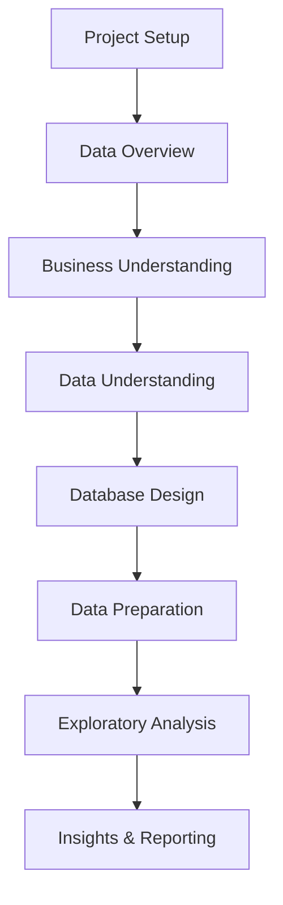

# 📊 Data Analysis & Modeling

Metodologias práticas, templates e guias para projetos completos de análise de dados e modelação.

## 🎯 **Guias Práticos**

### [📋 Analysis Methodology](analysis_methodology.md)
**Workflow completo CRISP-DM adaptado para Data Analytics**
- ✅ 7 fases estruturadas: Setup → Overview → Business → Data → Design → Preparation → EDA → Reporting
- ✅ Checklists práticos para cada fase
- ✅ Templates Python/SQL prontos a usar
- ✅ Toolkit avançado com 50+ funções úteis

### [✅ Project Checklist](project_checklist.md)  
**Checklist sequencial rápido para projetos de analytics**
- ✅ Passos essenciais por fase
- ✅ Comandos Python/SQL fundamentais
- ✅ Definition of Done para cada etapa

### [🏗️ Data Modeling Guide](data_modeling_guide.md)
**Conceitos fundamentais e práticas de modelação**
- ✅ Entidades, Relacionamentos, Fact & Dimension Tables
- ✅ Star Schema design patterns
- ✅ Slowly Changing Dimensions (SCD)
- ✅ Validation & Testing strategies

### [💾 SQL Templates](sql_templates.md)
**Biblioteca de queries SQL para análise**
- ✅ Data profiling e quality assessment
- ✅ Join validation e relationship analysis  
- ✅ Time series e cohort analysis
- ✅ Window functions e performance optimization

## 🛠️ **Toolkit Recomendado**

### Python Stack
```bash
# Core analysis
uv add pandas numpy matplotlib seaborn plotly
uv add jupyter sqlalchemy psycopg2-binary

# Advanced analytics  
uv add scikit-learn scipy statsmodels
uv add pandas-profiling great-expectations
```

### SQL Databases
- **PostgreSQL** - Analysis avançada com window functions
- **DuckDB** - Analytics em ficheiros (Parquet, CSV)
- **SQLite** - Prototyping e datasets pequenos
- **BigQuery/Snowflake** - Cloud data warehousing

### Visualization Tools
- **Plotly/Dash** - Interactive dashboards
- **Tableau** - Business intelligence
- **Jupyter Notebooks** - Exploratory analysis
- **Apache Superset** - Open source BI

## 🔄 **Workflow Recomendado**



### Quick Start
1. **Setup**: `uv init` + estrutura de pastas + `.env`
2. **Overview**: Inventário rápido com `df.info()`, `df.describe()`
3. **Business**: Definir KPIs e critérios de sucesso
4. **Understanding**: Data profiling completo + quality assessment
5. **Design**: ER diagram + estratégia de joins
6. **Preparation**: ETL + feature engineering + validation
7. **EDA**: Correlações, segmentações, insights quantificados
8. **Reporting**: 1-pager + reprodutível package

## 📈 **Casos de Uso Típicos**

### Customer Analytics
- **Segmentação** por comportamento e valor
- **Cohort analysis** para retenção
- **Lifetime value** prediction
- **Churn analysis** e early warning

### Sales Analytics  
- **Performance dashboards** por região/produto
- **Seasonal patterns** e forecasting
- **Conversion funnel** analysis
- **Price optimization** studies

### Operational Analytics
- **Process optimization** com time series
- **Resource allocation** optimization  
- **Quality metrics** monitoring
- **Capacity planning** analysis

## 🎯 **Best Practices**

### ✅ **Do's**
- Começar com business understanding claro
- Validar qualidade dos dados antes da análise
- Documentar assumptions e limitações
- Criar scripts reproduzíveis
- Testar conclusions com different time periods

### ❌ **Don'ts**  
- Assumir que correlação = causação
- Ignorar missing data patterns
- Sobre-complicar o modelo inicial
- Esquecer de validar joins antes de usar
- Deixar análises sem actionable insights

---

> 🎯 **Getting Started:** Começa com o [Analysis Methodology](analysis_methodology.md) para um workflow estruturado, ou vai direto aos [SQL Templates](sql_templates.md) se já tens dados para explorar!